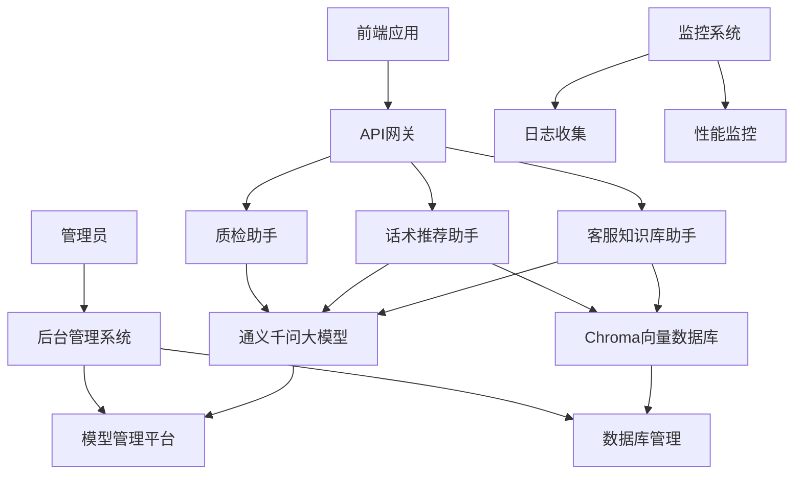

# 大模型客服助手项目

## 项目概述

大模型客服助手项目是一个基于人工智能技术的智能客服解决方案，旨在提升客服效率、改善客户体验并降低运营成本。该项目利用通义千问大模型和Chroma向量数据库，实现了客服知识库管理、智能话术推荐和自动化质检等核心功能。

## 核心功能

### 1. 客服知识库助手
- **客户问题抽取**: 自动从对话中提取关键问题
- **意图识别与改写**: 识别客户意图并优化查询表达
- **标准问/相似问生成**: 自动生成标准问题和相似问题
- **话术提炼**: 生成电话话术和电催话术

### 2. 话术推荐助手
- **实时对话情境理解**: 分析对话主题、阶段和客户情绪
- **用户意图识别**: 识别用户当前和潜在意图
- **RAG话术推荐**: 基于检索增强生成技术推荐合适话术
- **个性化话术适配**: 根据客户特征个性化话术内容

### 3. 质检助手
- **对话内容解析**: 结构化处理客服对话内容
- **语音转文字处理**: 将语音对话转换为文字
- **大模型自动化质检**: 基于AI技术自动评估服务质量
- **结果生成与复核**: 生成质检报告并支持复核流程

## 技术架构

### 系统架构图



### 技术栈

- **编程语言**: Python 3.9+
- **大模型框架**: LangChain + DashScope SDK (通义千问)
- **向量数据库**: Chroma
- **Web框架**: FastAPI
- **数据库**: PostgreSQL + Redis
- **部署**: Docker + Docker Compose
- **异步处理**: Celery

## 项目目录结构

```
customer_service_ai/
├── README.md                           # 项目说明文档
├── requirements.txt                    # 项目依赖
├── docker-compose.yml                  # Docker编排文件
├── Dockerfile                          # Docker构建文件
├── .env                                # 环境变量配置文件
├── app/                                # 应用主目录
│   ├── __init__.py                     # Python包初始化文件
│   ├── main.py                         # 应用入口文件
│   ├── config/                         # 配置管理模块
│   ├── core/                           # 核心模块
│   ├── assistants/                     # 助手模块
│   ├── api/                            # API接口模块
│   ├── utils/                          # 工具模块
│   └── tests/                          # 测试模块
└── docs/                               # 文档目录
```

## 核心模块设计

### 大模型集成模块
提供与通义千问大模型的统一交互接口，支持文本生成、对话交互、向量化处理等功能。

### 向量数据库集成模块
提供与Chroma向量数据库的交互接口，支持文档存储、相似性检索、集合管理等功能。

### 客服知识库助手模块
负责客户问题处理、意图识别、问题生成和话术提炼等知识库管理功能。

### 话术推荐助手模块
负责对话情境分析、意图识别、话术推荐和个性化适配等智能推荐功能。

### 质检助手模块
负责对话解析、语音转文字、质量检查和报告生成等质检功能。

## API接口

### 客服知识库助手接口
- `POST /api/v1/knowledge-base/extract-questions` - 问题抽取
- `POST /api/v1/knowledge-base/classify-intent` - 意图识别
- `POST /api/v1/knowledge-base/generate-questions` - 问题生成
- `POST /api/v1/knowledge-base/generate-scripts` - 话术生成

### 话术推荐助手接口
- `POST /api/v1/script-recommender/analyze-context` - 情境分析
- `POST /api/v1/script-recommender/recognize-intent` - 意图识别
- `POST /api/v1/script-recommender/recommend-scripts` - 话术推荐
- `POST /api/v1/script-recommender/personalize-script` - 个性化适配

### 质检助手接口
- `POST /api/v1/quality-inspector/parse-conversation` - 对话解析
- `POST /api/v1/quality-inspector/transcribe` - 语音转文字
- `POST /api/v1/quality-inspector/inspect` - 自动质检
- `POST /api/v1/quality-inspector/generate-report` - 报告生成

## 部署说明

### 环境要求
- Python 3.9+
- Docker & Docker Compose
- 通义千问API密钥
- Chroma数据库服务

### 部署步骤
1. 克隆项目代码
2. 配置环境变量
3. 安装依赖: `pip install -r requirements.txt`
4. 启动服务: `docker-compose up -d`
5. 访问API: `http://localhost:8000`

## 测试策略

### 单元测试
- 各模块核心功能测试
- 数据模型验证测试
- 异常处理测试

### 集成测试
- 模块间接口联调测试
- API接口测试
- 性能压力测试

### 部署测试
- 环境部署验证
- 服务可用性测试
- 监控告警测试

## 项目文档

- [架构设计文档](architecture.md) - 系统整体架构设计
- [技术栈说明](tech_stack.md) - 技术选型和依赖说明
- [项目目录结构](project_structure.md) - 详细的目录结构说明
- [配置管理模块设计](config_module_design.md) - 配置管理模块详细设计
- [大模型集成模块设计](llm_module_design.md) - 大模型集成模块详细设计
- [向量数据库模块设计](vector_db_module_design.md) - 向量数据库模块详细设计
- [客服知识库助手模块设计](knowledge_base_module_design.md) - 知识库助手模块详细设计
- [话术推荐助手模块设计](script_recommender_module_design.md) - 话术推荐模块详细设计
- [质检助手模块设计](quality_inspector_module_design.md) - 质检助手模块详细设计
- [接口联调设计](interface_integration_design.md) - 模块间接口联调设计

## 项目优势

1. **智能化程度高**: 基于大模型技术，具备强大的自然语言理解和生成能力
2. **模块化设计**: 各功能模块独立，便于维护和扩展
3. **实时性强**: 支持实时对话分析和话术推荐
4. **可扩展性好**: 微服务架构支持水平扩展
5. **部署简便**: Docker容器化部署，简化运维工作
6. **监控完善**: 集成日志和性能监控系统

## 后续规划

1. **功能优化**: 持续优化各模块的准确性和性能
2. **模型升级**: 跟进通义千问新版本，提升AI能力
3. **扩展集成**: 支持更多第三方系统集成
4. **用户体验**: 优化前端界面和交互体验
5. **数据分析**: 增强数据统计和分析能力
6. **安全加固**: 加强系统安全防护机制

## 贡献指南

欢迎提交Issue和Pull Request来改进本项目。请遵循以下步骤：

1. Fork项目
2. 创建功能分支
3. 提交更改
4. 发起Pull Request

## 许可证

本项目采用MIT许可证，详情请见[LICENSE](LICENSE)文件。