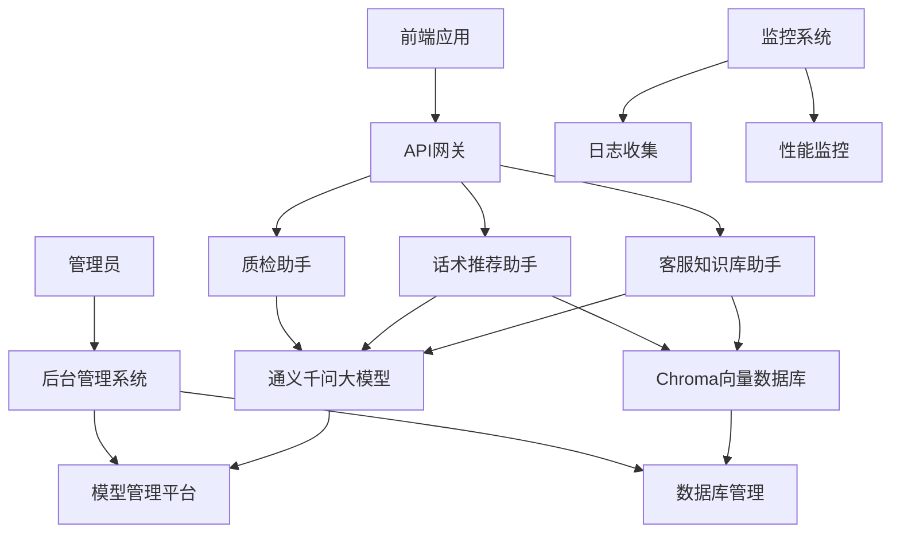

# 大模型客服助手系统架构设计

## 系统整体架构图

## 架构层次说明

### 1. 应用层
- **前端应用**: 提供给客服人员使用的Web界面
- **后台管理系统**: 管理员配置和监控系统运行状态的界面

### 2. 接入层
- **API网关**: 统一入口，负责请求路由、认证、限流等功能

### 3. 业务逻辑层
- **客服知识库助手**: 处理客户问题抽取、意图识别、标准问生成等
- **话术推荐助手**: 实时对话理解、用户意图识别、RAG话术推荐等
- **质检助手**: 对话内容解析、语音转文字、自动化质检等

### 4. AI能力层
- **通义千问大模型**: 提供核心的自然语言理解和生成能力
- **Chroma向量数据库**: 存储和检索知识库向量数据，支持RAG功能

### 5. 管理层
- **模型管理平台**: 大模型的配置、监控和管理
- **数据库管理**: 向量数据库的维护和管理

### 6. 支撑层
- **监控系统**: 实时监控系统运行状态
- **日志收集**: 收集系统运行日志用于问题排查
- **性能监控**: 监控系统性能指标