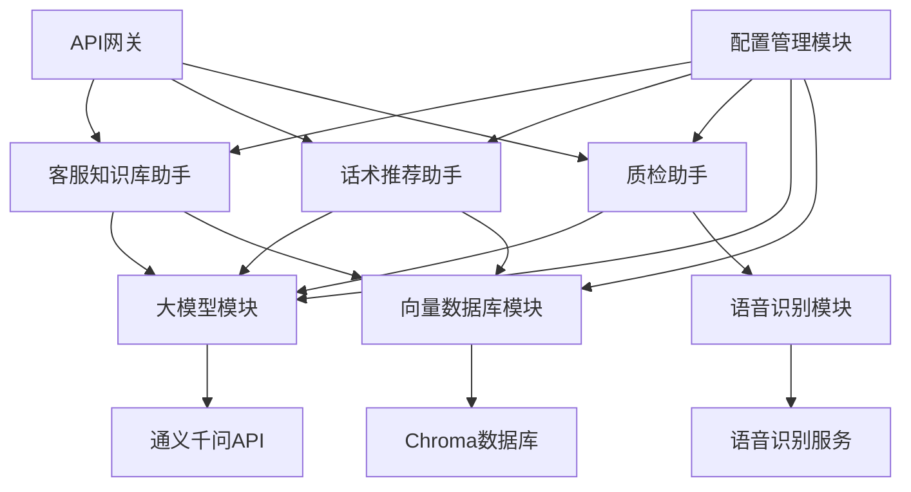
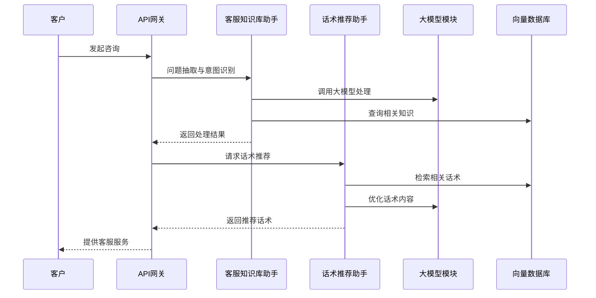
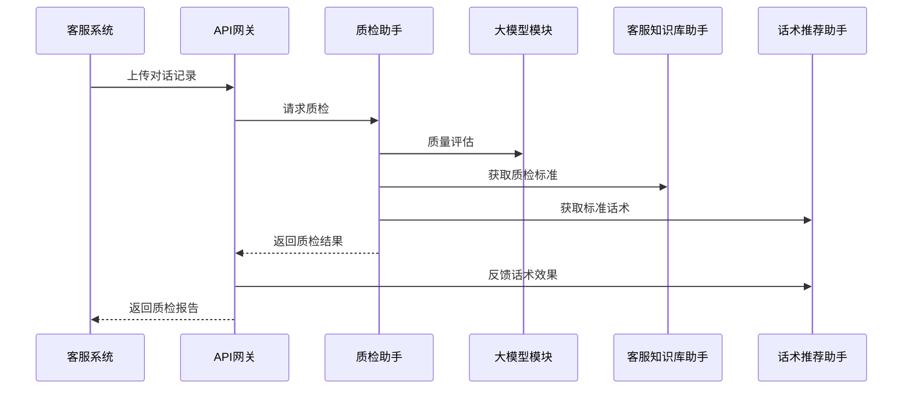

# 模块间接口联调设计

## 概述

本设计文档描述了大模型客服助手项目中各核心模块间的接口联调方案，确保各个模块能够高效协同工作，形成完整的客服解决方案。

## 模块交互关系图



## 核心接口设计

### 1. 客服知识库助手与话术推荐助手接口

#### 知识共享接口
```python
class KnowledgeSharingInterface:
    """
    知识共享接口
    用于客服知识库助手向话术推荐助手提供知识支持
    """
    
    def get_standard_questions(self, category: str, count: int = 10) -> List[str]:
        """
        获取标准问题
        
        Args:
            category (str): 问题分类
            count (int): 返回数量
            
        Returns:
            List[str]: 标准问题列表
        """
        pass
    
    def get_question_context(self, question: str) -> QuestionContext:
        """
        获取问题上下文信息
        
        Args:
            question (str): 问题内容
            
        Returns:
            QuestionContext: 问题上下文
        """
        pass
    
    def search_similar_questions(self, query: str, count: int = 5) -> List[str]:
        """
        搜索相似问题
        
        Args:
            query (str): 查询内容
            count (int): 返回数量
            
        Returns:
            List[str]: 相似问题列表
        """
        pass

class QuestionContext:
    """
    问题上下文数据模型
    """
    
    def __init__(self, question: str, related_questions: List[str], 
                 relevant_scripts: List[str], category_info: dict):
        self.question = question                    # 问题内容
        self.related_questions = related_questions  # 相关问题
        self.relevant_scripts = relevant_scripts    # 相关话术
        self.category_info = category_info          # 分类信息
```

#### 意图识别结果共享
```python
class IntentSharingInterface:
    """
    意图识别结果共享接口
    """
    
    def share_intent_result(self, session_id: str, intent: IntentClassification):
        """
        共享意图识别结果
        
        Args:
            session_id (str): 会话ID
            intent (IntentClassification): 意图识别结果
        """
        pass
    
    def get_shared_intent(self, session_id: str) -> Optional[IntentClassification]:
        """
        获取共享的意图识别结果
        
        Args:
            session_id (str): 会话ID
            
        Returns:
            Optional[IntentClassification]: 意图识别结果
        """
        pass
```

### 2. 话术推荐助手与质检助手接口

#### 话术使用反馈接口
```python
class ScriptFeedbackInterface:
    """
    话术使用反馈接口
    用于质检助手向话术推荐助手反馈话术使用效果
    """
    
    def submit_script_feedback(self, script_id: str, session_id: str, 
                             effectiveness: float, issues: List[str] = None):
        """
        提交话术使用反馈
        
        Args:
            script_id (str): 话术ID
            session_id (str): 会话ID
            effectiveness (float): 有效性评分(0-1)
            issues (List[str]): 发现的问题
        """
        pass
    
    def get_script_performance(self, script_id: str) -> ScriptPerformance:
        """
        获取话术表现数据
        
        Args:
            script_id (str): 话术ID
            
        Returns:
            ScriptPerformance: 话术表现数据
        """
        pass

class ScriptPerformance:
    """
    话术表现数据模型
    """
    
    def __init__(self, script_id: str, usage_count: int, avg_effectiveness: float,
                 success_rate: float, common_issues: List[str]):
        self.script_id = script_id              # 话术ID
        self.usage_count = usage_count          # 使用次数
        self.avg_effectiveness = avg_effectiveness  # 平均有效性
        self.success_rate = success_rate        # 成功率
        self.common_issues = common_issues      # 常见问题
```

#### 对话情境共享接口
```python
class ContextSharingInterface:
    """
    对话情境共享接口
    """
    
    def share_conversation_context(self, session_id: str, context: ConversationContext):
        """
        共享对话情境
        
        Args:
            session_id (str): 会话ID
            context (ConversationContext): 对话情境
        """
        pass
    
    def get_conversation_context(self, session_id: str) -> Optional[ConversationContext]:
        """
        获取对话情境
        
        Args:
            session_id (str): 会话ID
            
        Returns:
            Optional[ConversationContext]: 对话情境
        """
        pass
```

### 3. 客服知识库助手与质检助手接口

#### 质检标准接口
```python
class QualityStandardsInterface:
    """
    质检标准接口
    用于客服知识库助手向质检助手提供质检标准
    """
    
    def get_quality_standards(self, category: str) -> QualityStandards:
        """
        获取质检标准
        
        Args:
            category (str): 业务分类
            
        Returns:
            QualityStandards: 质检标准
        """
        pass
    
    def get_standard_scripts(self, scenario: str) -> List[str]:
        """
        获取标准话术
        
        Args:
            scenario (str): 场景描述
            
        Returns:
            List[str]: 标准话术列表
        """
        pass

class QualityStandards:
    """
    质检标准数据模型
    """
    
    def __init__(self, category: str, attitude_requirements: dict,
                 professionalism_requirements: dict, compliance_requirements: dict):
        self.category = category                            # 业务分类
        self.attitude_requirements = attitude_requirements  # 态度要求
        self.professionalism_requirements = professionalism_requirements  # 专业性要求
        self.compliance_requirements = compliance_requirements  # 合规性要求
```

#### 问题识别接口
```python
class IssueIdentificationInterface:
    """
    问题识别接口
    """
    
    def identify_common_issues(self, conversation: ParsedConversation) -> List[str]:
        """
        识别常见问题
        
        Args:
            conversation (ParsedConversation): 解析后的对话
            
        Returns:
            List[str]: 识别出的常见问题
        """
        pass
    
    def get_issue_solutions(self, issue_type: str) -> List[str]:
        """
        获取问题解决方案
        
        Args:
            issue_type (str): 问题类型
            
        Returns:
            List[str]: 解决方案列表
        """
        pass
```

## 数据流设计

### 1. 客户咨询处理流程



### 2. 质检处理流程



## 接口调用规范

### 1. 调用协议
- 使用RESTful API风格
- 采用JSON格式传输数据
- 使用HTTP状态码表示调用结果

### 2. 错误处理
```python
class APIError(Exception):
    """API调用异常"""
    
    def __init__(self, code: int, message: str, details: dict = None):
        self.code = code            # 错误码
        self.message = message      # 错误信息
        self.details = details or {} # 详细信息

# 常见错误码
ERROR_CODES = {
    400: "请求参数错误",
    401: "身份验证失败",
    403: "权限不足",
    404: "资源不存在",
    500: "服务器内部错误",
    503: "服务暂时不可用"
}
```

### 3. 超时设置
```python
# 接口调用超时配置
TIMEOUT_CONFIG = {
    "knowledge_base": 10,      # 知识库助手调用超时(秒)
    "script_recommender": 15,  # 话术推荐助手调用超时(秒)
    "quality_inspector": 30,   # 质检助手调用超时(秒)
    "llm_client": 60,          # 大模型调用超时(秒)
    "vector_db": 5             # 向量数据库调用超时(秒)
}
```

## 性能优化策略

### 1. 缓存机制
```python
class InterModuleCache:
    """
    模块间缓存管理
    """
    
    def cache_knowledge_result(self, key: str, value: Any, ttl: int = 3600):
        """缓存知识库结果"""
        pass
    
    def cache_script_result(self, key: str, value: Any, ttl: int = 1800):
        """缓存话术推荐结果"""
        pass
    
    def cache_inspection_result(self, key: str, value: Any, ttl: int = 7200):
        """缓存质检结果"""
        pass
```

### 2. 异步处理
```python
async def async_knowledge_processing(self, request: KnowledgeRequest) -> KnowledgeResponse:
    """
    异步知识处理
    
    Args:
        request (KnowledgeRequest): 知识处理请求
        
    Returns:
        KnowledgeResponse: 知识处理响应
    """
    pass

async def async_script_recommendation(self, request: ScriptRequest) -> ScriptResponse:
    """
    异步话术推荐
    
    Args:
        request (ScriptRequest): 话术推荐请求
        
    Returns:
        ScriptResponse: 话术推荐响应
    """
    pass
```

### 3. 批量处理
```python
def batch_knowledge_processing(self, requests: List[KnowledgeRequest]) -> List[KnowledgeResponse]:
    """
    批量知识处理
    
    Args:
        requests (List[KnowledgeRequest]): 知识处理请求列表
        
    Returns:
        List[KnowledgeResponse]: 知识处理响应列表
    """
    pass

def batch_script_recommendation(self, requests: List[ScriptRequest]) -> List[ScriptResponse]:
    """
    批量话术推荐
    
    Args:
        requests (List[ScriptRequest]): 话术推荐请求列表
        
    Returns:
        List[ScriptResponse]: 话术推荐响应列表
    """
    pass
```

## 监控与日志

### 1. 接口调用监控
- 接口调用次数统计
- 接口响应时间监控
- 接口错误率统计
- 接口流量监控

### 2. 数据流转日志
```python
class DataFlowLogger:
    """
    数据流转日志记录器
    """
    
    def log_data_transfer(self, source_module: str, target_module: str, 
                         data_type: str, data_size: int, transfer_time: float):
        """
        记录数据流转日志
        
        Args:
            source_module (str): 源模块
            target_module (str): 目标模块
            data_type (str): 数据类型
            data_size (int): 数据大小(字节)
            transfer_time (float): 传输时间(秒)
        """
        pass
    
    def log_interface_call(self, interface_name: str, caller: str, 
                          callee: str, call_time: float, success: bool):
        """
        记录接口调用日志
        
        Args:
            interface_name (str): 接口名称
            caller (str): 调用方
            callee (str): 被调用方
            call_time (float): 调用时间(秒)
            success (bool): 是否成功
        """
        pass
```

## 安全考虑

### 1. 接口安全
- API密钥认证
- 请求签名验证
- 访问权限控制
- 数据加密传输

### 2. 数据安全
- 敏感数据脱敏
- 数据访问审计
- 数据备份机制
- 数据保留策略

## 测试策略

### 1. 接口测试
```python
class InterfaceTestCase:
    """
    接口测试用例
    """
    
    def test_knowledge_script_interface(self):
        """测试知识库与话术推荐接口"""
        pass
    
    def test_script_quality_interface(self):
        """测试话术推荐与质检接口"""
        pass
    
    def test_knowledge_quality_interface(self):
        """测试知识库与质检接口"""
        pass
```

### 2. 集成测试
- 模块间数据流转测试
- 异常处理流程测试
- 性能压力测试
- 安全性测试

## 部署考虑

### 1. 服务发现
- 使用服务注册与发现机制
- 负载均衡配置
- 健康检查机制
- 故障自动切换

### 2. 配置管理
- 统一配置中心
- 配置版本管理
- 配置热更新
- 配置安全保护